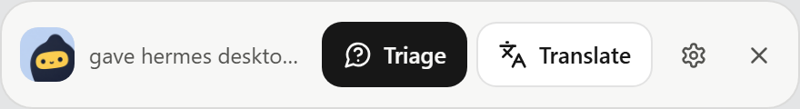
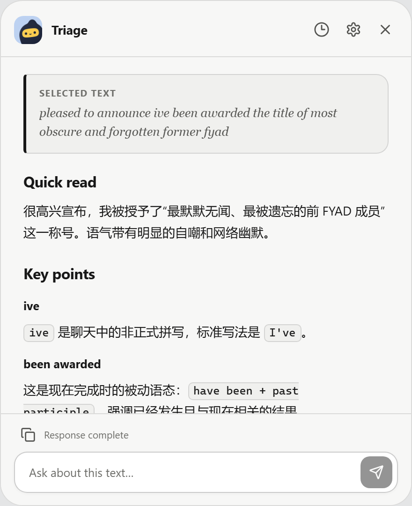
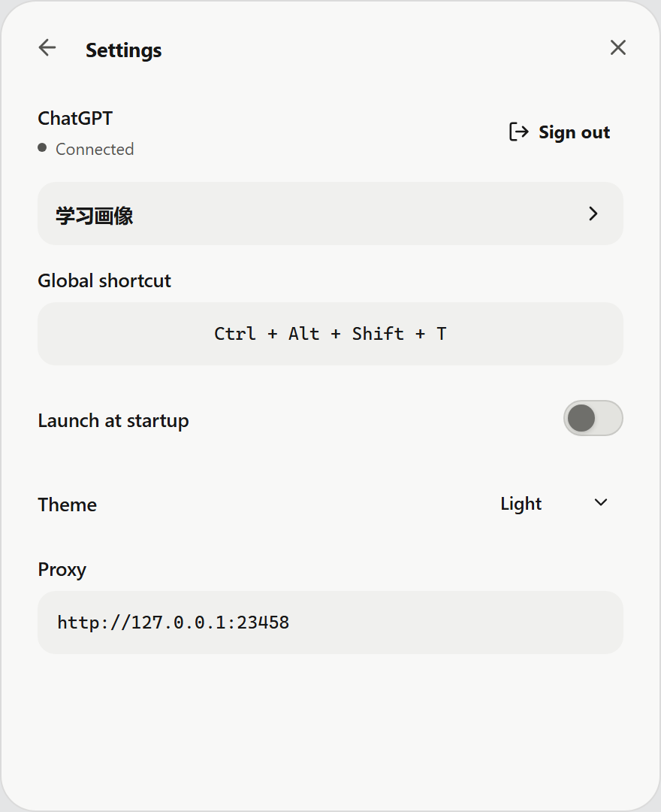

# Gloss

Gloss 是 Windows 上的英文阅读助手，也支持自适应中英文双向翻译。选中文本，按下快捷键，即可获得贴合语境的讲解或翻译，并围绕原文继续追问。

  

## 阅读，不打断当前页面

- **Triage**：理解原文，梳理值得关注的表达、句式与背景。
- **Translate**：自动识别中文或英文，并翻译成另一种语言。
- **继续追问**：直接提问，或选中回答中的片段快速解释。

<table>
  <tr>
    <td width="50%"></td>
    <td width="50%"></td>
  </tr>
  <tr>
    <td align="center">Triage</td>
    <td align="center">Settings</td>
  </tr>
</table>

## 安装

支持 Windows 10/11。前往 [Releases](../../releases) 下载 Windows x64 安装程序，并使用可访问 Codex 的 ChatGPT 账号登录。

## 使用

1. 选中中文或英文文本。
2. 按 `Ctrl + Alt + Shift + T` 唤出 Gloss。
3. 选择 **Triage** 或 **Translate**。

快捷键、主题、代理和开机启动均可在 Settings 中调整。

## 开发

[开发文档](docs/development.md) · [第三方组件](THIRD_PARTY_NOTICES.md)
